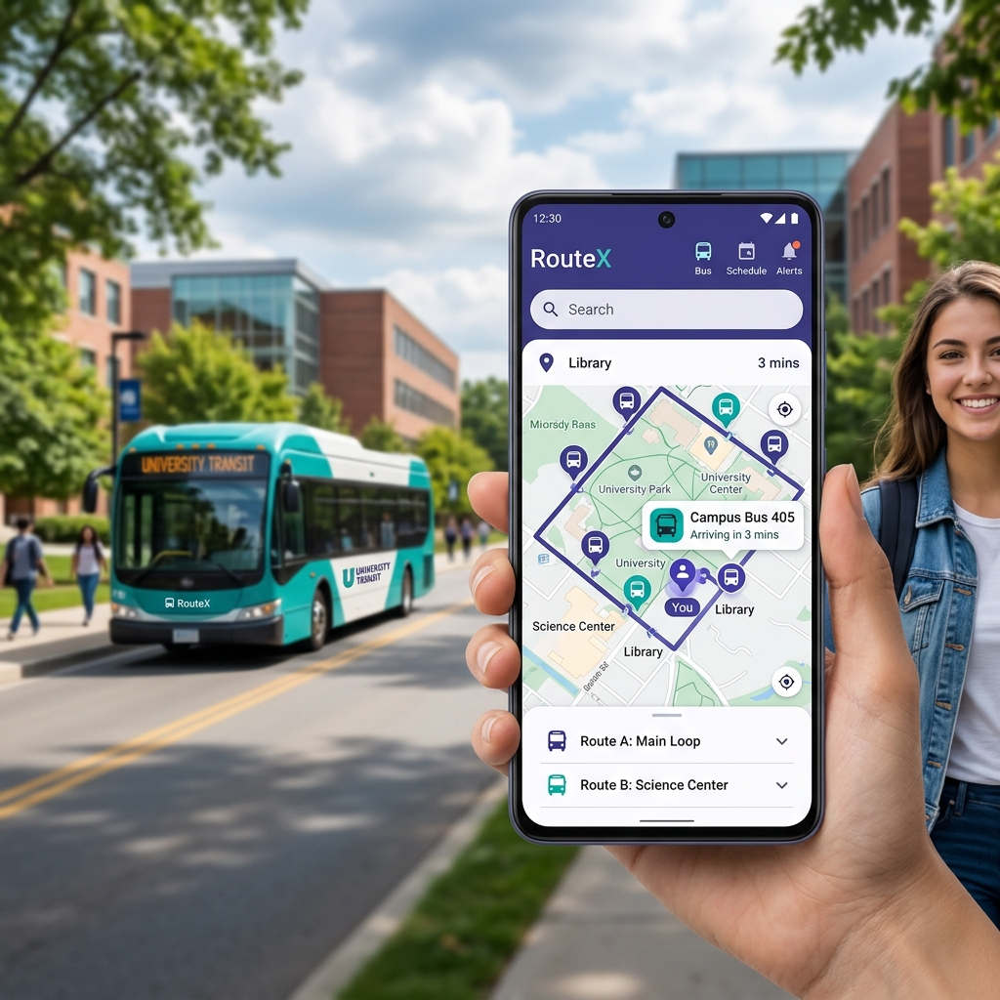
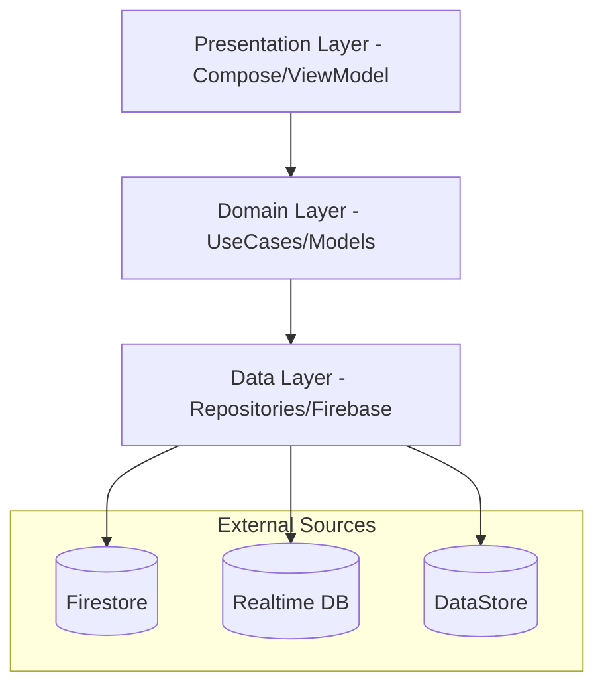

# RouteX – Smart Campus Transit System 🚌



**RouteX** is a production-grade, real-time campus bus tracking solution built with **Kotlin**, **Jetpack Compose**, and **Clean Architecture**. It provides a seamless experience for students, drivers, and administrators to monitor and manage college transportation.

---

## 🌟 Key Features

### 🧑‍🎓 Student Module
- **Live Tracking**: Real-time bus movement on Google Maps with smooth animations.
- **Intelligent ETA**: Accurate "Time to Arrival" predictions using Haversine distance and real-time speed caching.
- **Stop Notifications**: Get alerted as your bus approaches your selected stop.
- **Route Search**: Easily find and filter available bus routes.

### 🚌 Driver Module
- **Trip Lifecycle**: Simple `Start` and `End` trip management.
- **Background GPS**: Persistent location broadcasting even when the screen is off.
- **Duty Dashboard**: Clear view of assigned routes and bus details.

### 🛡️ Admin Dashboard
- **Real-time Oversight**: Monitor all active trips and bus locations from a central hub.
- **Fleet Management**: Full CRUD operations for Bus, Driver, and Route entities.
- **Analytics**: Key performance indicators like active buses, student registrations, and trip completion rates.
- **Emergency Alerts**: Dispatch system-wide notifications for delays or breakdowns.

---

## 📱 App Preview


---

## 🏗️ Architecture & Tech Stack

### Clean Architecture (MVVM)
The project follows a strict three-layer separation to ensure scalability and testability:



### 🛠️ Technology Stack
| Category | Tech / Library |
|---|---|
| **Language** | Kotlin 1.9.24 |
| **UI Framework** | Jetpack Compose (Material 3) |
| **Dependency Injection** | Hilt 2.51.1 |
| **Navigation** | Jetpack Navigation Compose |
| **Backend** | Firebase (Auth, Firestore, RTDB, FCM) |
| **Maps** | Google Maps Compose SDK |
| **Concurrency** | Kotlin Coroutines & Flow |
| **Local Storage** | DataStore Preferences |

---

## 🚀 Getting Started

### 1. Prerequisites
- Android Studio Iguana | 2023.2.1 or newer.
- A Firebase project with Auth, Firestore, and RTDB enabled.
- A Google Maps API Key.

### 2. Configuration
1. Clone the repository.
2. Place your `google-services.json` in the `app/` directory.
3. Create a `local.properties` file in the root and add your Maps API Key:
   ```properties
   MAPS_API_KEY=your_api_key_here
   ```

### 3. Build & Run
```bash
./gradlew assembleDebug
```

---

## 📦 Releasing the APK

To generate a professional, signed release APK, follow these steps:

### 1. Generate a Keystore
If you don't have one, generate a release keystore using the `keytool`:
```bash
keytool -genkey -v -keystore routex-release.jks -keyalg RSA -keysize 2048 -validity 10000 -alias routex
```

### 2. Configure Build Properties
Add the following credentials to your `local.properties` (keep this file secret!):
```properties
KEY_STORE_FILE=routex-release.jks
KEY_STORE_PASSWORD=your_keystore_password
KEY_ALIAS=routex
KEY_PASSWORD=your_key_password
```

### 3. Generate Signed APK
Run the following Gradle command:
```bash
./gradlew assembleRelease
```
The signed APK will be available at:
`app/build/outputs/apk/release/app-release.apk`

---

## 👨‍💻 Author

**Amrut**  
[GitHub](https://github.com/Amrut735)

---

> [!NOTE]  
> This project was developed as a production-ready solution for campus transit tracking at KLS GIT.
