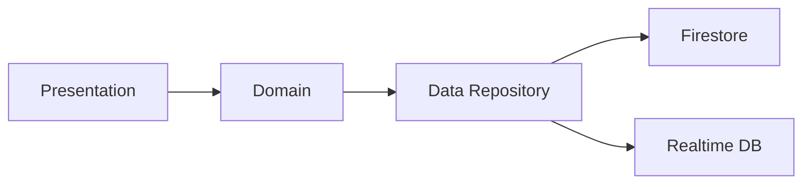

<div align="center">


# 🚌 RouteX

**Know your ride. Save your time.**

*The smarter way to track, manage, and optimize campus bus routes with real-time precision.*

[](https://kotlinlang.org/)
[](https://developer.android.com/jetpack/compose)
[](https://firebase.google.com/)
[](https://developers.google.com/maps)

[-blue?style=flat-square)](https://github.com/Amrut735/RouteX)
[](LICENSE)

</div>

---

## 🤔 Why Does This Exist?

Waiting for a campus bus should not be a guessing game. 

**60% of students** report missing buses or being late to classes due to unpredictable arrival times. Existing scheduling systems often fail to account for traffic, breakdowns, or delays. **RouteX** bridges this gap with a production-grade, real-time tracking engine that provides live locations and traffic-aware ETA predictions, ensuring you never miss a ride again.

---

## ✨ Core Pillars

### 🧑‍🎓 Student Experience
- **Live Tracking**: See your bus move in real-time on a modern Material 3 map.
- **Smart ETA**: Haversine-based distance calculations with rolling speed averaging for precise arrival times.
- **Stay Informed**: Automated notifications as the bus approaches your designated stop.

### 🚌 Driver Power
- **One-Tap Broadcasting**: Seamless GPS broadcasting with a foreground service to maintain connection.
- **Trip Lifecycle**: Auto-detection of trip status (`Running`, `Delayed`, `Completed`).
- **Safety First**: Real-time speed monitoring and emergency alert broadcasting.

### 📊 Admin Intelligence
- **Fleet Control**: Centralized management of buses, drivers, and routes.
- **Dashboard Analytics**: Visualize student load, route efficiency, and trip completion rates.
- **Emergency Dispatch**: Instantly notify all students on a route about disruptions.

---

## 📱 App Preview

<div align="center">

<br />
<em>Live Tracking & Admin Dashboard Mockups</em>
<br /><br />

<br />
<em>Streamlined Development: ADB Build & Install Lifecycle</em>
</div>

---

## 🏗️ Technical Foundation

### Clean Architecture & MVVM
Built with a philosophy of modularity and testability. The domain layer remains pure Kotlin, while the data layer leverages the full power of Firebase's real-time capabilities.



### Tech Stack Grid
- **Modern UI**: 100% Jetpack Compose with Material 3 Design System.
- **Reactive State**: `StateFlow` and `SharedFlow` for real-time reactivity.
- **DI**: Powered by Hilt for efficient dependency management.
- **Maps**: Deep integration with Google Maps SDK for Android.

---

## 🚀 Deployment Guide

### Releasing the APK
To move from development to a production-ready signed APK:

1. **Keystore**:
   ```bash
   keytool -genkey -v -keystore routex-release.jks -keyalg RSA -keysize 2048 -validity 10000 -alias routex
   ```

2. **Properties**: Add `KEY_STORE_FILE`, `KEY_STORE_PASSWORD`, `KEY_ALIAS`, and `KEY_PASSWORD` to your `local.properties`.

3. **Build**:
   ```bash
   ./gradlew assembleRelease
   ```
   *The signed APK will be generated at `app/build/outputs/apk/release/app-release.apk`*

---

<div align="center">
Developed with ❤️ by <b>Amrut</b>
<br />
<a href="https://github.com/Amrut735">GitHub</a> • <a href="https://github.com/Amrut735/RouteX/issues">Report Bug</a>
</div>
